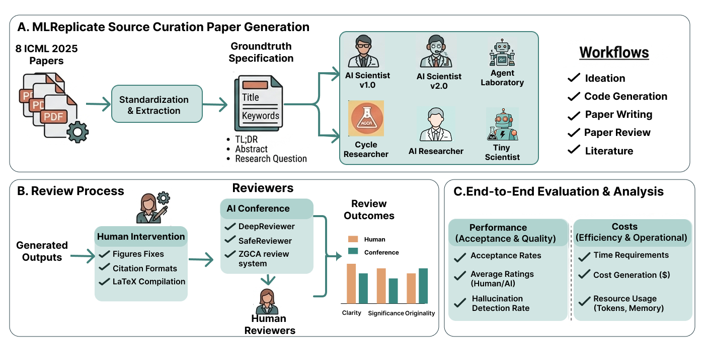

# MLReplicate: Benchmarking Autonomous AI Research Systems

MLReplicate is an end-to-end benchmark for evaluating autonomous research systems on machine learning reproducibility.

Autonomous systems that can generate full scientific manuscripts have improved quickly, but realistic evaluation has lagged behind. This repository provides a practical benchmark designed to measure not only paper-like output quality, but also scientific validity, reproducibility behavior, resource usage, and required human intervention.



The benchmark is built from ICML 2025 outstanding papers converted into standardized input tasks and executed across six state-of-the-art autonomous research systems:

- AI-Scientist-v1
- AI-Scientist-v2
- Agent Laboratory
- CycleResearcher
- AI-Researcher
- Tiny-Scientist

## Abstract-Style Summary

We evaluate autonomous research systems using a dual-protocol framework:

- Automated conference-style review
- Structured human expert review

Across benchmark runs, systems produced 45 generated manuscripts with 3 failed experiments. Automated review accepted 10 out of 37 valid submissions, and 8 additional submissions were desk-rejected before review for not meeting minimum page requirements. In contrast, human reviewers consistently identified methodological flaws, hallucinated results, and reproducibility failures across all systems. Notably, 59% of papers accepted by automated review contained fabricated or unsupported claims.

We also observe that token budget and compute cost do not reliably predict quality. In our study, the cheapest system outperformed the most resource-intensive system in human evaluation despite a 38x difference in input tokens. This suggests that autonomous workflow design matters more than raw compute scale for scientific reliability.

MLReplicate highlights the current gap between autonomous manuscript generation and rigorous scientific practice, and provides a reproducible evaluation framework for measuring progress.

## Key Contributions

- A unified benchmark for autonomous ML research reproducibility.
- Standardized benchmark inputs derived from real, high-quality ML papers.
- Cross-system evaluation over six autonomous research agents.
- Dual evaluation protocol combining automated and human review.
- Explicit tracking of runtime, compute cost, token usage, and intervention requirements.

## Benchmark at a Glance

- Source tasks: Reformulated ICML 2025 outstanding papers.
- Systems evaluated: 6
- Generated manuscripts: 45
- Failed experiments: 3
- Valid automated-review submissions: 37
- Automated accepts: 10
- Desk rejects before review: 8
- Automated accepts containing fabricated/unsupported claims: 59%

## Repository Structure

This repository aggregates multiple autonomous research systems and their benchmark adapters.

```text
MLReplicate/
	README.md
	dataset/                      # Shared source dataset assets
	AgentLaboratory/              # Agent Laboratory benchmark integration
	AI-Researcher/                # AI-Researcher benchmark integration
	AI-Scientist-v1/              # AI Scientist v1 benchmark integration
	AI-Scientist-v2/              # AI Scientist v2 benchmark integration
	cycle-researcher/             # CycleResearcher benchmark integration
	tiny-scientist/               # Tiny-Scientist benchmark integration
```

## Evaluation Protocol

### 1) Standardized Task Construction

Benchmark tasks are created by converting selected paper content into structured inputs consumable by each system (YAML/JSON/topic specs, depending on the target framework).

### 2) Autonomous Execution

Each system runs with minimal intervention and produces research artifacts (code, logs, figures, draft manuscripts, final papers where available).

### 3) Dual Review Pipeline

- Automated review: conference-style rubric and acceptance decision.
- Human review: structured expert assessment of methods, evidence quality, and reproducibility.

### 4) Systems + Efficiency Audit

In addition to quality scores, benchmark runs track:

- Runtime
- Token usage
- API or infrastructure cost
- Human interventions and recovery actions

## Systems Included

### Agent Laboratory

- Local benchmark driver: `AgentLaboratory/run_benchmark.py`
- SLURM launcher: `AgentLaboratory/run_benchmark.slurm`
- Dataset YAML generation helper: `AgentLaboratory/benchmark_utils/generate_dataset_yaml.py`

### AI-Researcher

- Entry point: `AI-Researcher/run_ai_researcher.py`
- SLURM launcher: `AI-Researcher/run_ai_researcher.slurm`
- Includes workspace bridging and run-time resource tracking utilities.

### AI-Scientist-v1

- Entry point: `AI-Scientist-v1/launch_scientist.py`
- Supports idea generation, novelty checks, experiment execution, and write-up/review workflow.

### AI-Scientist-v2

- Entry point: `AI-Scientist-v2/launch_scientist_bfts.py`
- Uses agentic tree search with configurable BFTS behavior in `AI-Scientist-v2/bfts_config.yaml`.

### CycleResearcher

- Benchmark runner: `cycle-researcher/run_benchmark.py`
- SLURM launcher: `cycle-researcher/run_benchmark.slurm`

### Tiny-Scientist

- Benchmark runner: `tiny-scientist/run_tiny_scientist.py`
- Includes detailed tracking for timing, module-level token costs, and CPU/GPU usage.

## Quick Start

Because this benchmark integrates heterogeneous frameworks, each system should be installed and run in its own environment.

## 1) Clone and inspect

```bash
git clone <your-fork-or-repo-url>
cd MLReplicate
```

## 2) Configure API keys

Most systems require at least one of:

- `OPENAI_API_KEY`
- `ANTHROPIC_API_KEY`
- `GEMINI_API_KEY`
- `OPENROUTER_API_KEY`
- `S2_API_KEY` (optional literature API for some pipelines)
- `HUGGINGFACE_TOKEN` (for CycleResearcher model access)

Set only the keys needed by the subsystem you run.

## 3) Run benchmark components

### Agent Laboratory

```bash
cd AgentLaboratory
uv venv --python 3.12
source .venv/bin/activate
uv pip install -r requirements.txt
uv run run_benchmark.py
```

Optional dataset-to-YAML generation:

```bash
uv run benchmark_utils/generate_dataset_yaml.py --pdf_dir ../dataset --output_dir dataset
```

### AI-Researcher

```bash
cd AI-Researcher
uv venv --python 3.11
source .venv/bin/activate
uv sync
python run_ai_researcher.py
```

Note: This integration may expect Singularity/container tooling and specific environment variables (for example `CATEGORY` and `INSTANCE_ID`) depending on run mode.

### AI-Scientist-v1

```bash
cd AI-Scientist-v1
python -m venv .venv
source .venv/bin/activate
pip install -r requirements.txt
python launch_scientist.py --experiment nanoGPT --model gpt-4o-2024-05-13 --num-ideas 2
```

### AI-Scientist-v2

```bash
cd AI-Scientist-v2
python -m venv .venv
source .venv/bin/activate
pip install -r requirements.txt
python launch_scientist_bfts.py --load_ideas ideas/i_cant_believe_its_not_better.json
```

### CycleResearcher

```bash
cd cycle-researcher
uv venv --python 3.11
source .venv/bin/activate
uv pip install -e .
uv run run_benchmark.py
```

### Tiny-Scientist

```bash
cd tiny-scientist
python -m venv .venv
source .venv/bin/activate
pip install -e .
python run_tiny_scientist.py "Reproduce a small ML experiment with robust logging"
```

## Expected Outputs

Each subsystem stores outputs in its local experiment/log folders, typically including:

- Generated ideas and plans
- LLM-generated code and experiment scripts
- Run logs and tracebacks
- Resource/cost tracking summaries
- Draft or final manuscript artifacts (LaTeX/PDF when successful)

Examples:

- `AgentLaboratory/experiments/`
- `AI-Researcher/results/`
- `AI-Scientist-v1/results/`
- `AI-Scientist-v2/experiments/`
- `cycle-researcher/experiments/`
- `tiny-scientist/tracked_experiments/`

## Interpreting Results Safely

When comparing systems, do not rely on acceptance-style automated review alone. Use human evaluation and reproducibility checks as primary signals. In this benchmark, automated acceptance can substantially overestimate scientific reliability due to fabricated or weakly supported claims.

Recommended reporting dimensions:

- Scientific correctness and methodological soundness
- Reproducibility of claims and experiments
- Hallucination/error rate in reported findings
- Cost/quality trade-off
- Human intervention burden

## Reproducibility Notes

- Prefer pinned environments per subsystem.
- Record exact model versions and API backends.
- Keep raw logs and intermediate outputs for auditability.
- Run in sandboxed/containerized settings when executing LLM-generated code.

## Limitations

- Different systems use different internal workflows and toolchains.
- API/model availability changes over time and can affect outcomes.
- Hardware differences impact latency and sometimes execution success.
- Automatic review signals can diverge from expert judgment.

## License

This repository includes multiple integrated projects with their own licenses. See top-level `LICENSE` and subsystem-specific license files before redistribution or commercial use.

## Citation

If you use this benchmark in research, cite your benchmark paper and this repository. You can replace the placeholder below with your final citation metadata.

```bibtex
@misc{mlreplicate2026,
	title={MLReplicate: Benchmarking Autonomous Research Systems for Machine Learning Reproducibility},
	author={Anonymous},
	year={2026},
	note={Benchmark repository}
}
```

## Contact

For benchmark issues, reproducibility concerns, or contributions, open an issue or pull request in this repository.
